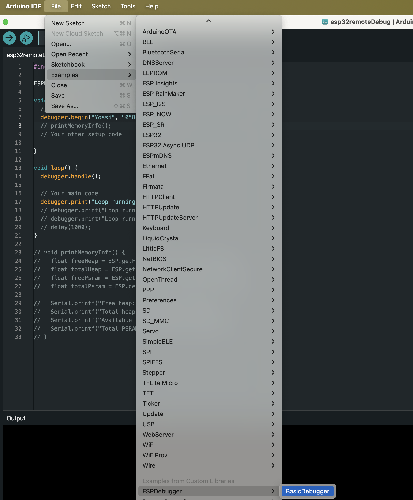

# ESPDebugger

## Description
ESPDebugger is a Arduino library  designed for remote debugging of ESP32 devices. It provides a convenient way to monitor and troubleshoot ESP32 projects via web interface or Telnet connection. With support for Over-The-Air (OTA) updates and easy integration into both existing and new projects, ESPDebugger streamlines the development and maintenance of ESP32-based applications.

## Features
- Remote debugging via web interface
- Telnet connection support for command-line debugging
- Real-time monitoring of ESP32 device status
- Over-The-Air (OTA) update capability
- Seamless integration with both existing and new ESP32 projects
- Minimal setup required for quick deployment

## Installation
1. Clone this repository:
2. Copy the ESPDebugger folder to your Arduino libraries directory.
3. Restart the Arduino IDE if it's already running.

## Usage Example
Here's a basic example of how to use ESPDebugger in your ESP32 
(can use the builtin exempel )

```cpp
#include "ESPDebugger.h"
ESPDebugger debugger;

void setup() {
  debugger.begin("SSID", "Password");
// Your existing setup code

}

void loop() {
  debugger.handle();
// Your existing loop code
  debugger.print("Loop running...");

}
